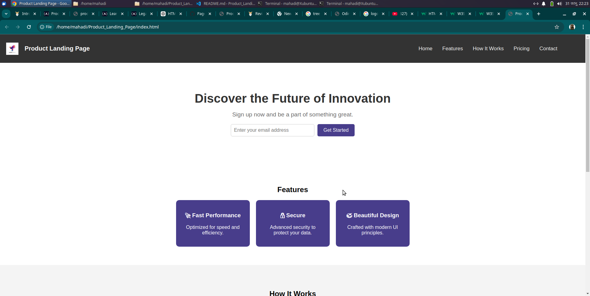

# 🚀 Product Landing Page

This is a **responsive Product Landing Page** built using HTML, CSS, and embedded media. The page includes a fixed navigation bar, a hero section with an email subscription form, feature highlights, a promotional video, pricing plans, and a contact footer.

## 📌 Features

- 🏗 **Fixed Navigation Bar** – Always stays on top for easy access.
- 📧 **Email Subscription Form** – Allows users to sign up.
- 🎨 **Modern & Responsive Design** – Looks great on all devices.
- 📹 **Embedded YouTube Video** – Demonstrates how the product works.
- 💲 **Pricing Section** – Displays different pricing plans.
- 📩 **Contact Section** – Provides an email for inquiries.

## 🛠 Technologies Used

- **HTML5** – Structure of the page.
- **CSS3** – Styling and responsive design.
- **YouTube Embed (iframe)** – For video integration.

## 🔧 Setup & Usage

1. **Clone this repository**  
   ```sh
   git clone https://github.com/your-username/product-landing-page.git

2. **Navigate to the project folder**  
   ```sh
   cd product-landing-page

3. **Open index.html in a browser**  

- You can directly open the file in your browser.
- Or use Live Server in VS Code for a better experience.

## 📷 Screenshot

Here are some screenshots of the Product Landing Page:




4. **Live Demo**  
- View the live demo (https://mahadi24t.github.io/Product_Landing_Page/)

🚀 ***Future Enhancements***
- Add animations for a smoother experience.
- Improve accessibility for better usability.
- Integrate backend to store email subscriptions.

📝 ***License***

- This project is open-source and free to use under the MIT License.